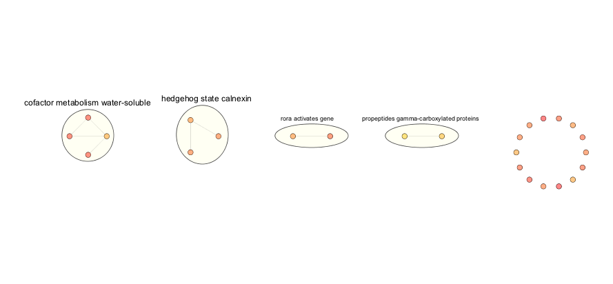
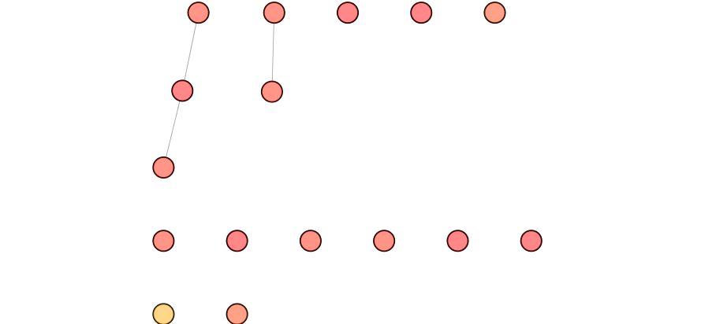

Following a complete predictor run, you will want to evaluate the performance of the predictor and examine the nature of feature-selected variables. 

# Software Requirements
For this example to work, you will require the following components to be installed. You may have already installed these when you first setup netDx but if not, make sure these are set up now:

* Cytoscape must be installed and running.
* Cytoscape apps EnrichmentMap (v3.0.0) and AutoAnnotate (v1.2) must be installed.
* R packages: `httr`, `RJSONIO`
* R packages r2cytoscape and EasycyRest.

**Note:If Cytoscape is not running, this example will not work!**

Let us see if the required dependencies can be installed and/or loaded:

```{r}
#httr
tryCatch(expr = { library(httr)}, 
          error = function(e) { install.packages("httr")}, finally = library(httr))

#RJSONIO
tryCatch(expr = { library(RJSONIO)}, 
          error = function(e) { install.packages("RJSONIO")}, finally = library(RJSONIO))

#r2cytoscape
tryCatch(expr = { library(r2cytoscape)}, 
          error = function(e) { devtools::install_github('cytoscape/cytoscape-automation/for-scripters/R/r2cytoscape')}, finally = library(r2cytoscape))

# EasycyRest
tryCatch(expr = { library(EasycyRest); detach(package:EascyRest,unload=TRUE)}, 
          error = function(e) { devtools::install_github('BaderLab/Easycyrest/EasycyRest@0.1')}, finally = {})
```

Now let us test if Cytoscape is open:

```{r}
# Basic settings
version.url <-"http://localhost:1234/v1/version"
cytoscape.open <- TRUE

tryCatch(expr = { GET(version.url)}, 
         error = function(e) { return (cytoscape.open = FALSE)}, finally =function(r){ return(cytoscape.open = TRUE)})
         
if(!cytoscape.open){
  #try and launch cytoscape
 stop("Cytoscape is not open.  Please launch cytoscape.")
} else{
  cytoscape.version <-  GET(version.url)
  cy.version <- fromJSON(rawToChar(cytoscape.version$content))
  print(cy.version)
}
```

### Predictor Design

For this example, the predictor has been run using a **nested cross-validation design**. In nested cross-validation, cross-validation is performed repeatedly over multiple random splits of the data into train and blind test partitions. Feature selected networks are those that consistently score highly across the multiple splits. 
Conceptually, this is what the higher-level logic looks like for a nested cross-validation design with 10-fold CV in the inner loop, and 100 splits in the outer loop:

*(Note: these aren't real function calls; this block just serves to illustrate the concept of the nested CV design for our purposes)*
```{r,eval=FALSE}
outerLoop <- 100     # num times to split data into train/blind test samples
innerLoop <- 10      # num folds for cross-validation, also max score for a network
netScores <- list()  # collect <outerLoop> set of netScores
perf <- list()       # collect <outerLoop> set of test evaluations

for k in 1:outerLoop
 [train, test] <- splitData(80:20) # split data using RNG seed
 netScores[[k]] <- runCV(train)
 perf[[k]] <- collectPerformance(netScores[[k]], test)
end
```

### Output directory structure
netDx expects a nested directory structure with the predictor results. The top level should contain one directory for each train/test split. Within each of these directories are the predictor results for the corresponding cross-validation. Here is the directory structure for a dataset with rootDirectory `dataset_yymmdd`.

```
dataset_yymmdd/
  + rng1/
    + tmp/       # directory created by netDx, containing input data for GeneMANIA database
    + networks/  # PSN created by calls to makePSN_NamedMatrix()
    +-- Class1
       + tmp/
       + networks/                               # networks for test classification for this split
       + GM_results/                             # results of inner loop (10-fold CV)
       + Class1_pathway_CV_score.txt             # network scores for inner CV fold
       +--- CV_1.query                           # query for CV fold
       +--- CV_1.query-results.report.txt.NRANK  # network weights for CV fold
       ...
       +--- CV_10.query                           
       +--- CV_10.query-results.report.txt.NRANK  
    +-- Class2
    + predictionResults.txt  # test predictions for this train/test split
  + rng2/
  + rng3/
  + rng4/
  ...
  + rng100/
```
### Set up

```{r,eval=TRUE}
suppressMessages(require(netDx))
suppressMessages(require(netDx.examples))
```

### Load data for plotting
In this example, we use data from The Cancer Genome Atlas (http://cancergenome.nih.gov/), downloaded from the PanCancer Survival project (https://www.synapse.org/#!Synapse:syn1710282). We use gene expression profiles from renal clear cell carcinoma tumours to predict poor and good survival after Yuan et al. (2014) (Refs 1-2). The data consists of 150 tumours. Here we work only with the gene expression profiles generated.

```{r,eval=TRUE}
phenoFile <- sprintf("%s/extdata/KIRC_pheno.rda",path.package("netDx.examples"))
lnames <- load(phenoFile)
head(pheno)
```

Create a directory to store output in:
```{r}
outDir <- paste(getwd(),"plots",sep="/")
if (!file.exists(outDir)) dir.create(outDir)
setwd(outDir)
```

Now compile the paths to output files. First get the list of all directories corresponding to the outer loops:

```{r}
inDir <- sprintf("%s/extdata/KIRC_output",
	path.package("netDx.examples"))
all_rngs <- list.dirs(inDir, recursive = FALSE)
print(head(basename(all_rngs)))
```


Each `rngX/` directory contains the results of a particular train/test split. The two classes in question are `SURVIVEYES` (good survival) and `SURVIVENO` (poor survival).

```{r,eval=TRUE}
dir(all_rngs[1])
```

### Plotting overall predictor performance
First we evaluate the average performance of the predictor over the 100 train/blind test splits. Performance is defined as the Area under the Receiver Operator Characteristic curve (AUROC) or Area under the Precision-Recall curve (AUPR).

First compile prediction files for all the 100 splits in the example data. These paths are stored in `predFiles`. Then call the performance-plotting function, which is `plotPerf()`.

```{r,eval=TRUE,fig.width=6,fig.height=6}
predClasses <- c("SURVIVEYES","SURVIVENO")
predFiles <- unlist(lapply(all_rngs, function(x) 
		paste(x, "predictionResults.txt", sep = "/")))
predPerf <- plotPerf(inDir, predClasses=predClasses)
```


### Feature-level scores
Feature-level scores are one of the outputs of feature-selection. These indicate the predictive strength of a feature, so that networks with higher scores indicate those with greater predictive power for the class in question. Note that in netDx, feature selection occurs once per patient class (i.e. here, once for `SURVIVEYES` and once for `SURVIVENO`), so each feature gets a predictive score for each class.

This nested design has an outer loop of 100 splits with 10-fold cross-validation in the inner loop. Each network can therefore score between 0 and 10 (max number of cross-validation folds) for a given split. For the 100 splits, feature scores can be viewed as a matrix *X* which is *N*-by-100, where `N` is the number of networks. *X[i,j]* is the score for network *i* for split *j*. 


***Note:***In practice, we do not include networks that never score >0, so the number of rows is < *N*.

```{r,eval=TRUE}
featScores <- getFeatureScores(inDir,predClasses=c("SURVIVEYES","SURVIVENO"))
```

The size of `featScores` should correspond to number of networks that score >0 
at least once (rows) and the number of train/test splits (here, 100):

```{r,eval=TRUE}
dim(featScores[[1]])
```
The first column shows feature names:
```{r,eval=TRUE}
head(featScores[[1]][,1:10])
```


Let us define **feature-selected networks** as those that score 10 out of 10 in 
at least 70% of the train/test splits.
```{r,eval=TRUE}
featSelNet <- lapply(featScores, function(x) {
	callFeatSel(x, fsCutoff=10, fsPctPass=0.7)
})
```

Let's take a look at the top networks for each class:
```{r,eval=TRUE}
tmp <- lapply(featSelNet,print)
```

### Plotting the Enrichment Map
An EnrichmentMap is a network-based visualization for a group of overlapping sets (Ref 3). Here, we use this visualization to examine which pathways and functional themes are feature-selected for each patient class. So, this is a network where nodes are **features** (here, pathways), and edges indicate **shared members between the features** (here, genes common to the pathway).

By clustering and annotating the EnrichmentMap using the AutoAnnotate app (Ref 4), we can identify functional themes that are common among high-scoring features. 

Get the set of valid gene sets.
```{r}
pathFile <- sprintf("%s/extdata/Human_160124_AllPathways.gmt",
           path.package("netDx.examples"))
pathwayList <- readPathways(pathFile)
```
Filter for the genes measured in this dataset
```{r}
xpr_genes <- sprintf("%s/extdata/EMap_input/genenames.txt",
      path.package("netDx.examples"))
xpr_genes <- read.delim(xpr_genes,h=FALSE,as.is=TRUE)[,1]
head(xpr_genes)
```
Filter:
```{r}
pathwayList <- lapply(pathwayList, function(x) x[which(x %in% xpr_genes)])
```

To create an enrichment map in netDx, you need two files:

1. **A .gmt file:** A file with top-scoring genesets in the GMT format, similar to the example pathway file.
2. **Node attribute table:** A table containing the names of features and the maximum score each achieves across cross-validation.

Here we generate the above two files for each patient class. We have two sets of files because each class has its own set of predictive features and therefore, its own enrichment map (EM).

In addition to objects we have seen before, this step requires a table indicating what type of data each network represents. This may be used to assign visual features (e.g. node shapes) to distinguish different data sources in the EM.

```{r}
netInfoFile <- sprintf("%s/extdata/KIRC_output/inputNets.txt",
      path.package("netDx.examples"))
netInfo <- read.delim(netInfoFile,sep="\t",h=FALSE,as.is=TRUE)
head(netInfo)
```

Create the EnrichmentMap input:
```{r}
EMap_input <- writeEMapInput_many(featScores,pathwayList,
      netInfo,outDir=outDir)
```

Finally, plot the EnrichmentMap:
```{r}
pngFiles <- list()
for (curGroup in names(EMap_input)[1:2]) {
	pngFiles[[curGroup]] <- plotEmap(gmtFile=EMap_input[[curGroup]][1], 
		                        nodeAttrFile=EMap_input[[curGroup]][2],
		                        netName=curGroup,outDir=outDir)
}
```

The enrichment map showing the top-scoring networks for `SURVIVEYES` should now be active in Cytoscape. It should look like this:



Nodes are coloured by the highest consistent score the particular feature achieved; consistency is defined as having achieved the score for >70% of the splits. 

**Note:** Node labels for individual features have been turned off to remove visual clutter. These can be enabled interactively in Cytoscape.

There should also be a second EnrichmentMap for the 'SURVIVENO' class.

{width=50%}


### Computing the integrated patient similarity network
An integrated patient network is constructed by aggregating feature-selected networks for all classes. It represents the overall view of patient similarity that results from identifying predictive networks through the netDx predictor.

For the visualization we actually prefer to magnify **dissimilarity** so that similar patients are closer (i.e. have smaller edge weight) and dissimilar patients are farther apart (i.e. have larger edge weight). So the network generated in this step is really a **dissimilarity network**. The steps for computing this network are:

1. Concatenate all feature-selected networks
2. For all patient pairs, collapse edges by taking the mean similarity.
3. Convert to dissimilarity (`1-mean_similarity`).
4. For the Cytoscape visualization, keep a certain fraction of the top edges (e.g. top 20% disimilarities).

The function `plotIntegratedPSN()` runs these computations. It therefore needs access to the folder that contains all the feature-selected networks. Here we provide `rng1/` for that purpose using the `baseDir` argument.

```{r,eval=TRUE}
netInfo <- plotIntegratedPSN(pheno=pheno,baseDir=sprintf("%s/rng1",inDir),
	netNames=featSelNet,outDir=outDir)
```
The Cytoscape session should now show a network that looks like this: 


The returned `netInfo` object contains several pieces of information related to the integrated network shown above, including the path to the full similarity network (`aggPSN_FULL`), the pruned dissimilarity network (`aggPDN_pruned`), and information about the resulting view in Cytoscape (`network_suid` and `netView`).


```{r,eval=TRUE}
summary(netInfo)
```

# sessionInfo

```{r}
sessionInfo()
```

# References
1. Yuan, Y. *et al.* (2014) Assessing the clinical utility of cancer genomic and proteomic data across tumor types. *Nat Biotechnol* **32**, 644-52.
2. The Cancer Genome Atlas Research Network (2013). Comprehensive molecular characterization of clear cell renal cell carcinoma. *Nature* **499**, 43-9.
3. Merico, D., Isserlin, R. & Bader, G.D. (2011). Visualizing gene-set enrichment results using the Cytoscape plug-in enrichment map. *Methods Mol Biol* **781**, 257-77.
4. Kucera, M., Isserlin, R., Arkhangorodsky, A. & Bader, G.D. (2016). AutoAnnotate: A Cytoscape app for summarizing networks with semantic annotations. *F1000Res* **5**, 1717.


