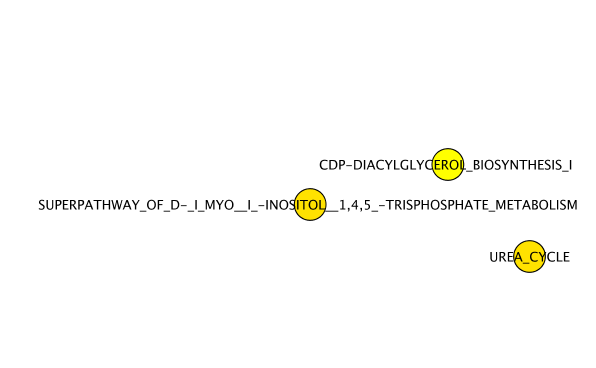
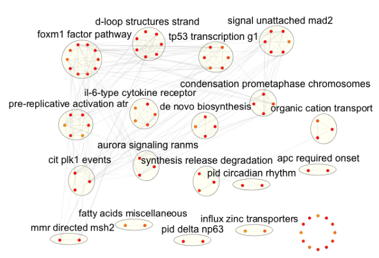

# TL;DR
This code block is not evaluated. Need a breakdown? Look at the following sections.
```{r,eval=FALSE}
suppressWarnings(suppressMessages(require(netDx)))
suppressMessages(library(curatedTCGAData))
# get input data
brca <- suppressMessages(curatedTCGAData("BRCA",c("mRNAArray"),FALSE))

# format input
staget <- sub("[abcd]","",sub("t","",colData(brca)$pathology_T_stage))
staget <- suppressWarnings(as.integer(staget))
colData(brca)$STAGE <- staget

pam50 <- colData(brca)$PAM50.mRNA
pam50[which(!pam50 %in% "Luminal A")] <- "notLumA"
pam50[which(pam50 %in% "Luminal A")] <- "LumA"
colData(brca)$pam_mod <- pam50

idx <- union(which(pam50 == "Normal-like"), which(is.na(staget)))
pID <- colData(brca)$patientID
tokeep <- setdiff(pID, pID[idx])
brca <- brca[,tokeep,]

# remove duplicate assays mapped to the same sample
smp <- sampleMap(brca)
samps <- smp[which(smp$assay=="BRCA_mRNAArray-20160128"),]
notdup <- samps[which(!duplicated(samps$primary)),"colname"]
brca[[1]] <- suppressMessages(brca[[1]][,notdup])

# sample metadata table must have ID and STATUS columns
pID <- colData(brca)$patientID
colData(brca)$ID <- pID
colData(brca)$STATUS <- colData(brca)$pam_mod

# create grouping rules
groupList <- list()
# genes in mRNA data are grouped by pathways
pathList <- readPathways(fetchPathwayDefinitions("January",2018))
groupList[["BRCA_mRNAArray-20160128"]] <- pathList[1:3]
# clinical data is not grouped; each variable is its own feature
groupList[["clinical"]] <- list(
      age="patient.age_at_initial_pathologic_diagnosis",
	   stage="STAGE"
)

# define function to create features
makeNets <- function(dataList, groupList, netDir,...) {
	netList <- c() # initialize before is.null() check
	# make RNA nets (NOTE: the check for is.null() is important!)
	# (Pearson correlation)
	if (!is.null(groupList[["BRCA_mRNAArray-20160128"]])) { 
	netList <- makePSN_NamedMatrix(dataList[["BRCA_mRNAArray-20160128"]],
				rownames(dataList[["BRCA_mRNAArray-20160128"]]),
			   	groupList[["BRCA_mRNAArray-20160128"]],
				netDir,verbose=FALSE, 
			  	writeProfiles=TRUE,...) 
	}
	
	# make clinical nets (normalized difference)
	netList2 <- c()
	if (!is.null(groupList[["clinical"]])) {
	netList2 <- makePSN_NamedMatrix(dataList$clinical, 
		rownames(dataList$clinical),
		groupList[["clinical"]],netDir,
		simMetric="custom",customFunc=normDiff, # custom function
		writeProfiles=FALSE,
		sparsify=TRUE,verbose=TRUE,...)
	}
	netList <- c(unlist(netList),unlist(netList2))
	return(netList)
}

# run predictor
set.seed(42) # make results reproducible
outDir <- sprintf("%s/pred_output",tempdir()) # location for intermediate work
# set keepAllData=TRUE to not delete at the end of the predictor run.
# This can be useful for debugging.
out <- suppressMessages(buildPredictor(dataList=brca,groupList=groupList,
  makeNetFunc=makeNets,outDir=outDir,
  numSplits=2L,featScoreMax=2L, featSelCutoff=1L,
	numCores=1L,logging="none"))

# reformat results 
numSplits <- 2
st <- unique(colData(brca)$STATUS)
acc <- c()         # accuracy
predList <- list() # prediction tables
featScores <- list() # feature scores per class
for (cur in unique(st)) featScores[[cur]] <- list()

for (k in 1:numSplits) { 
	pred <- out[[sprintf("Split%i",k)]][["predictions"]];
	# predictions table
	tmp <- pred[,c("ID","STATUS","TT_STATUS","PRED_CLASS",
	                 sprintf("%s_SCORE",st))]
	predList[[k]] <- tmp 
	# accuracy
	acc <- c(acc, sum(tmp$PRED==tmp$STATUS)/nrow(tmp))
	# feature scores
	for (cur in unique(st)) {
	   tmp <- out[[sprintf("Split%i",k)]][["featureScores"]][[cur]]
	   colnames(tmp) <- c("PATHWAY_NAME","SCORE")
	   featScores[[cur]][[sprintf("Split%i",k)]] <- tmp
	}
}

# plot ROC curve, PR curve, mean AUROC, mean AUPR
predPerf <- plotPerf(predList, predClasses=st)

# identify consistent high-performing features
featScores2 <- lapply(featScores, getNetConsensus)
summary(featScores2)
head(featScores2[["LumA"]])
featSelNet <- lapply(featScores2, function(x) {
    callFeatSel(x, fsCutoff=1, fsPctPass=0)
})

# plot EnrichmentMap
# create input
Emap_res <- getEMapInput_many(featScores2,pathList,
    minScore=1,maxScore=2,pctPass=0,out$inputNets,verbose=FALSE)
# write to files for Cytoscape
gmtFiles <- list()
nodeAttrFiles <- list()
for (g in names(Emap_res)) {
    outFile <- sprintf("%s/%s_nodeAttrs.txt",outDir,g)
    write.table(Emap_res[[g]][["nodeAttrs"]],file=outFile,
        sep="\t",col=TRUE,row=FALSE,quote=FALSE)
    nodeAttrFiles[[g]] <- outFile

    outFile <- sprintf("%s/%s.gmt",outDir,g)
    conn <- base::file(outFile,"w")
    tmp <- Emap_res[[g]][["featureSets"]]
    gmtFiles[[g]] <- outFile

    for (cur in names(tmp)) {
        curr <- sprintf("%s\t%s\t%s", cur,cur,
            paste(tmp[[cur]],collapse="\t"))
        writeLines(curr,con=conn)
    }
close(conn)
}
### plot EnrichmentMap - requires Cytoscape installed and running
### must also have EnrichmentMap and AutoAnnotate apps running
###plotEmap(gmtFiles[[1]],nodeAttrFiles[[1]],
###         groupClusters=TRUE, hideNodeLabels=TRUE)
```

# Introduction

In this example, we will build a binary breast tumour classifier from clinical data and gene expression data. We will use different rules to create features for each data layer. Specifically:

* Clinical data: Features are defined directly at the level of *variables*; similarity is defined by normalized difference.
* Gene expression data: Features are defined at the level of *pathways*; similarity is defined by pairwise Pearson correlation.

Feature scoring is performed over multiple random splits of the data into train and blind test partitions. Feature selected networks are those that consistently score highly across the multiple splits (e.g. those that score 9 out of 10 in >=70% of splits). 

Conceptually, this is what the higher-level logic looks like for a  cross-validation design. In the pseudocode example below, the predictor runs for 100 train/test splits. Within a split, features are scored from 0 to 10. Features scoring >=9 are used to predict labels on the held-out test set (20%).

*(Note: these aren't real function calls; this block just serves to illustrate the concept of the design for our purposes)*
```{r,eval=FALSE}
numSplits <- 100     # num times to split data into train/blind test samples
featScoreMax <- 10      # num folds for cross-validation, also max score for a network
featSelCutoff <- 9
netScores <- list()  # collect <numSplits> set of netScores
perf <- list()       # collect <numSplits> set of test evaluations

for k in 1:numSplits
 [train, test] <- splitData(80:20) # split data using RNG seed
  featScores[[k]] <- scoreFeatures(train, featScoreMax)
 topFeat[[k]] <- applyFeatCutoff(featScores[[k]])
 perf[[k]] <- collectPerformance(topFeat[[k]], test)
end
```

# Setup

```{r,eval=TRUE}
suppressWarnings(suppressMessages(require(netDx)))
```

# Data 

In this example, we use curated data from The Cancer Genome Atlas, through the BioConductor `curatedTCGAData` package. The goal is to classify a breast tumour into either a Luminal A subtype or otherwise. The predictor will integrate clinical variables selected by the user, along with gene expression data.

Here we load the required packages and download clinical and gene expression data.
```{r,eval=TRUE}
suppressMessages(library(curatedTCGAData))
```

Take a look at the available data without downloading any:
```{r,eval=TRUE}
curatedTCGAData(diseaseCode="BRCA", assays="*",dry.run=TRUE)
```

We will work only with the mRNA data in this example:
```{r,eval=TRUE}
brca <- suppressMessages(curatedTCGAData("BRCA",c("mRNAArray"),FALSE))
```

This next code block prepares the TCGA data. In practice you would do this once, and save the data before running netDx, but we run it here to see an end-to-end example. 

```{r,eval=TRUE}
staget <- sub("[abcd]","",sub("t","",colData(brca)$pathology_T_stage))
staget <- suppressWarnings(as.integer(staget))
colData(brca)$STAGE <- staget

pam50 <- colData(brca)$PAM50.mRNA
pam50[which(!pam50 %in% "Luminal A")] <- "notLumA"
pam50[which(pam50 %in% "Luminal A")] <- "LumA"
colData(brca)$pam_mod <- pam50

tmp <- colData(brca)$PAM50.mRNA
idx <- union(which(tmp %in% c("Normal-like","Luminal B","HER2-enriched")),
             		which(is.na(staget)))
pID <- colData(brca)$patientID
tokeep <- setdiff(pID, pID[idx])
brca <- brca[,tokeep,]

# remove duplicate asssays mapped to the same sample
smp <- sampleMap(brca)
samps <- smp[which(smp$assay=="BRCA_mRNAArray-20160128"),]
notdup <- samps[which(!duplicated(samps$primary)),"colname"]
brca[[1]] <- suppressMessages(brca[[1]][,notdup])
```

The important thing is to create `ID` and `STATUS` columns in the sample metadata table. netDx uses these to get the patient identifiers and labels, respectively.

```{r,eval=TRUE}
pID <- colData(brca)$patientID
colData(brca)$ID <- pID
colData(brca)$STATUS <- colData(brca)$pam_mod
```

# Design custom patient similarity networks (features)

netDx allows the user to define a custom function that takes patient data and variable groupings as input, and returns a set of patient similarity networks (PSN) as output. The user can customize what datatypes are used, how they are grouped, and what defines patient similarity for a given datatype. 

When running the predictor (next section), the user simply passes this custom function as an input variable; i.e. the `makeNetFunc` parameter when calling `buildPredictor()`.

***Note:*** While netDx provides a high degree of flexibility in achieving your design of choice, it is up to the user to ensure that the design, i.e. the similarity metric and variable groupings, is appropriate for your application. Domain knowledge is almost likely required for good design. 

netDx requires that this function take some generic parameters as input. These include:

* `dataList`: the patient data, provided as a `MultiAssayExperiment` object. Refer to the [tutorials for MultiAssayExperiment](https://bioconductor.org/packages/release/bioc/html/MultiAssayExperiment.html) to see how to construct those objects from data.
* `groupList`: sets of input data that would correspond to individual networks (e.g. genes grouped into pathways)
* `netDir`: the directory where the resulting PSN would be stored.

## dataList
Here the BRCA data is already provided to us as a `MultiAssayExperiment` object:

```
summary(brca)
```

## groupList
This object tells the predictor how to group units when constructing a network. For examples, genes may be grouped into a network representing a pathway. This object is a list; the names match those of `dataList` while each value is itself a list and reflects a potential network.

```{r,eval=TRUE}
groupList <- list()

# genes in mRNA data are grouped by pathways
pathList <- readPathways(fetchPathwayDefinitions("January",2018))
groupList[["BRCA_mRNAArray-20160128"]] <- pathList[1:3]
# clinical data is not grouped; each variable is its own feature
groupList[["clinical"]] <- list(
      age="patient.age_at_initial_pathologic_diagnosis",
	   stage="STAGE"
)
```

So the `groupList` variable has one entry per data *layer*:
```{r,eval=TRUE}
summary(groupList)
```

Each entry contains a list, with one entry per feature. Here we have 3 pathway-level features for mRNA and two variable-level features for clinical data.

For example, here are the networks to be created with RNA data. Genes corresponding to pathways are to be grouped into individual network. Such a groupList would create pathway-level networks:

```{r,eval=TRUE}
groupList[["BRCA_mRNAArray-20160128"]][1:3]
```

For clinical data, we want to keep each variable as its own network:

```{r,eval=TRUE}
head(groupList[["clinical"]])
```

## Define patient similarity for each network
This function is defined by the user and tells the predictor how to create networks from the provided input data.

This function requires `dataList`,`groupList`, and `netDir` as input variables. The residual `...` parameter is to pass additional variables to `makePSN_NamedMatrix()`, notably `numCores` (number of parallel jobs).

In this particular example, the custom similarity function does the following:

1. Creates *pathway-level networks from RNA* data using the default Pearson correlation measure `makePSN_NamedMatrix(writeProfiles=TRUE,...)`
2. Creates *variable-level networks from clinical* data using a custom similarity function of normalized difference: `makePSN_NamedMatrix(writeProfiles=FALSE,simMetric="custom",customFunc=normDiff)`.


```{r}
makeNets <- function(dataList, groupList, netDir,...) {
	netList <- c() # initialize before is.null() check
	# make RNA nets (NOTE: the check for is.null() is important!)
	# (Pearson correlation)
	if (!is.null(groupList[["BRCA_mRNAArray-20160128"]])) { 
	netList <- makePSN_NamedMatrix(dataList[["BRCA_mRNAArray-20160128"]],
				rownames(dataList[["BRCA_mRNAArray-20160128"]]),
			   	groupList[["BRCA_mRNAArray-20160128"]],
				netDir,verbose=FALSE, 
			  	writeProfiles=TRUE,...) 
	}
	
	# make clinical nets (normalized difference)
	netList2 <- c()
	if (!is.null(groupList[["clinical"]])) {
	netList2 <- makePSN_NamedMatrix(dataList$clinical, 
		rownames(dataList$clinical),
		groupList[["clinical"]],netDir,
		simMetric="custom",customFunc=normDiff, # custom function
		writeProfiles=FALSE,
		sparsify=TRUE,verbose=TRUE,...)
	}
	netList <- c(unlist(netList),unlist(netList2))
	return(netList)
}

```

**Note:** `dataList` and `groupList` are generic containers that can contain whatever object the user requires to create PSN. **The custom function gives the user complete flexibility in feature design**. 

# Build predictor

Finally we call the function that runs the netDx predictor. We provide:

* number of train/test splits over which to collect feature scores and average performance: `numSplits`, 
* maximum score for features in one round of feature selection  (`featScoreMax`, set to 10)
* threshold to call feature-selected networks for each train/test split (`featSelCutoff`); only features scoring this value or higher will be used to classify test patients, and
* the information to create the PSN, including patient data (`dataList`), how variables are to be grouped into networks (`groupList`) and the custom function to generate features (`makeNetFunc`).

Change `numCores` to match the number of cores available on your machine for 
parallel processing.

The call below runs 2 train/test splits. Within each split, it:

* splits data into train/test using the default split of 80:20
* score2 networks between 0 to 2 (i.e. `featScoreMax=2`)
* uses networks that score >=1 out of 2 (`featSelCutoff`) to classify test samples for that split.

These are unrealistically low values set so the example will run fast. In practice a good starting point is `featScoreMax=10`, `featSelCutoff=9` and `numSplits=100`, but these parameters depend on the sample sizes in the dataset and heterogeneity of the samples.
 
```{r,eval=TRUE}
set.seed(42) # make results reproducible
outDir <- sprintf("%s/pred_output",tempdir()) # location for intermediate work
# set keepAllData=TRUE to not delete at the end of the predictor run.
# This can be useful for debugging.
out <- suppressMessages(buildPredictor(dataList=brca,groupList=groupList,
  makeNetFunc=makeNets,outDir=outDir,
  numSplits=2L,featScoreMax=2L, featSelCutoff=1L,
	numCores=1L))
```

# Examine output
The results are stored in the list object returned by the `buildPredictor()` call.
This list contains:

* `inputNets`: all input networks that the model started with. 
* `Split<i>`: a list with results for each train-test split
  * `predictions`: real and predicted labels for test patients
  * `accuracy`: percent accuracy of predictions
  * `featureScores`: feature scores for each label (list with `g` entries, where `g` is number of patient labels). Each entry contains the feature selection scores for the corresponding label.
  * `featureSelected`: vector of features that pass feature selection. List of length `g`, with one entry per label.

```{r,eval=TRUE}
summary(out)
summary(out$Split1)
```

## Reformat results for further analysis

This code collects different components of model output to examine the results. 

```{r,eval=TRUE}
numSplits <- 2
st <- unique(colData(brca)$STATUS)
acc <- c()         # accuracy
predList <- list() # prediction tables

featScores <- list() # feature scores per class
for (cur in unique(st)) featScores[[cur]] <- list()

for (k in 1:numSplits) { 
	pred <- out[[sprintf("Split%i",k)]][["predictions"]];
	# predictions table
	tmp <- pred[,c("ID","STATUS","TT_STATUS","PRED_CLASS",
	                 sprintf("%s_SCORE",st))]
	predList[[k]] <- tmp 
	# accuracy
	acc <- c(acc, sum(tmp$PRED==tmp$STATUS)/nrow(tmp))
	# feature scores
	for (cur in unique(st)) {
	   tmp <- out[[sprintf("Split%i",k)]][["featureScores"]][[cur]]
	   colnames(tmp) <- c("PATHWAY_NAME","SCORE")
	   featScores[[cur]][[sprintf("Split%i",k)]] <- tmp
	}
}
```

## Compute model performance

After compiling the data above, plot accuracy for each train/test split:
```{r,eval=TRUE}
print(acc)
```

Create a ROC curve, a precision-recall curve, and plot average AUROC and AUPR:

```{r,eval=TRUE}
predPerf <- plotPerf(predList, predClasses=st)
```

## Examine feature scores and consistently high-scoring features

Use `getNetConsensus()` to convert the list data structure into a single table, one per patient label. The rows show train/test splits and the columns show features that consistently perform well. 

We then use `callFeatSel()` to identify features that consistently perform well across the various train/test splits. Because this is a toy example, we set the bar very low to get some features. Here we accept a feature if it scores 1 or higher (`fsCutoff=1`) in even one split (`fsPctPass=0.05`), setting the latter to a low positive fraction. 

```{r,eval=TRUE}
featScores2 <- lapply(featScores, getNetConsensus)
summary(featScores2)
head(featScores2[["LumA"]])
```

In practice, a recommended setting is `fsCutoff=9` and `fsPctPass=0.7` to get features that score at least 9 (out of 10) in at least 70% of the train/test splits.

```{r,eval=TRUE}
featSelNet <- lapply(featScores2, function(x) {
    callFeatSel(x, fsCutoff=1, fsPctPass=0)
})
print(head(featScores2[["LumA"]]))
print(head(featScores2[["notLumA"]]))
```

## Visualize EnrichmentMap 

An EnrichmentMap is a network-based visualization of pathway connectivity and is used in netDx to visualize themes in predictive pathway-based features. It is used in conjunction with AutoAnnotate to identify clusters, and apply auto-generated labels to these. For more information, see the [EnrichmentMap](https://www.baderlab.org/Software/EnrichmentMap) website at baderlab.org.

Use `getEMapInput_many()` to create the input that helps generate the EnrichmentMap in Cytoscape.

```{r,eval=TRUE}
Emap_res <- getEMapInput_many(featScores2,pathList,
    minScore=1,maxScore=2,pctPass=0,out$inputNets,verbose=FALSE)
```

Write the results to files that Cytoscape can read in:
```{r,eval=TRUE}
gmtFiles <- list()
nodeAttrFiles <- list()

for (g in names(Emap_res)) {
    outFile <- sprintf("%s/%s_nodeAttrs.txt",outDir,g)
    write.table(Emap_res[[g]][["nodeAttrs"]],file=outFile,
        sep="\t",col=TRUE,row=FALSE,quote=FALSE)
    nodeAttrFiles[[g]] <- outFile

    outFile <- sprintf("%s/%s.gmt",outDir,g)
    conn <- base::file(outFile,"w")
    tmp <- Emap_res[[g]][["featureSets"]]
    gmtFiles[[g]] <- outFile

    for (cur in names(tmp)) {
        curr <- sprintf("%s\t%s\t%s", cur,cur,
            paste(tmp[[cur]],collapse="\t"))
        writeLines(curr,con=conn)
    }
close(conn)
}
```

Finally, plot the EnrichmentMap. This step requires Cytoscape to be installed, along with the EnrichmentMap and AutoAnnotate apps. It also requires the Cytoscape application to be open and running on the machine running the code. This block is commented out for automatic builds on BioConductor, but a screenshot of the intended result is shown below.

```{r,eval=TRUE}
###plotEmap(gmtFiles[[1]],nodeAttrFiles[[1]],
###         groupClusters=TRUE, hideNodeLabels=TRUE)

```

This example EnrichmentMap isn't terribly exciting because of the low number of pathway features permitted, the upper bound on feature selection scores and low number of train/test splits. But hopefully it serves its purpose to be illustrative.



Here is an example of an EnrichmentMap generated by running the above predictor with more real-world parameter values, and all available pathways:



# Visualize integrated patient similarity network based on top features

We can apply a threshold to define predictive features, and integrate these into a single patient similarity network. Such a network is useful for downstream operations such as ascertaining whether or not classes are significantly separated and visualization. 

Here we define predictive features as those scoring 3 out of 3 in all train/test splits. 

```{r,eval=TRUE}
featScores2 <- lapply(featScores, getNetConsensus)
featSelNet <- lapply(featScores2, function(x) {
    callFeatSel(x, fsCutoff=2, fsPctPass=1)
})
```

We can examine the features:
```{r,eval=TRUE}
print(featSelNet)
```

Create a new `groupList` limited to top features:
```{r,eval=TRUE}
topPath <- gsub(".profile","",
		unique(unlist(featSelNet)))
topPath <- gsub("_cont.txt","",topPath)
# create groupList limited to top features
g2 <- list();
for (nm in names(groupList)) {
	cur <- groupList[[nm]]
	idx <- which(names(cur) %in% topPath)
	message(sprintf("%s: %i pathways", nm, length(idx)))
	if (length(idx)>0) g2[[nm]] <- cur[idx]
}
```

Plot the integrated patient network based on the features selected above. Note that at this stage, the similarity measure is inverted into a dissimilarity measure so that nodes with greater similarity are closer (have smaller distance or dissimilarity) in the final network. 

In the example below, the networks are integrated by taking the mean of the edge weights (`aggFun="MEAN"`). For the plotting we retain only the top 5% of the strongest edges (`topX=0.05`). 

By setting `calcShortestPath=TRUE`, the function will also compute the pairwise shortest path for within- and across-group nodes. The result is shown as a set of violin plots and a one-sided Wilcoxon-Mann-Whitney test is used to assign significance.

As with `plotEMap()`, this method must be run on a computer with Cytoscape installed and running. For the purposes of this example, `plotCytoscape` is set to `FALSE` and a screenshot of the resulting network is provided below. To plot in Cytoscape, set `plotCytoscape=TRUE`.

```{r,eval=TRUE}
psn <- plotIntegratedPatientNetwork(brca,
  groupList=g2, makeNetFunc=makeNets,
  aggFun="MEAN",topX=0.10,
  numCores=1L,calcShortestPath=TRUE,
  showStats=FALSE,
  verbose=FALSE, plotCytoscape=FALSE)
```

 
 
# sessionInfo
```{r}
sessionInfo()
```
