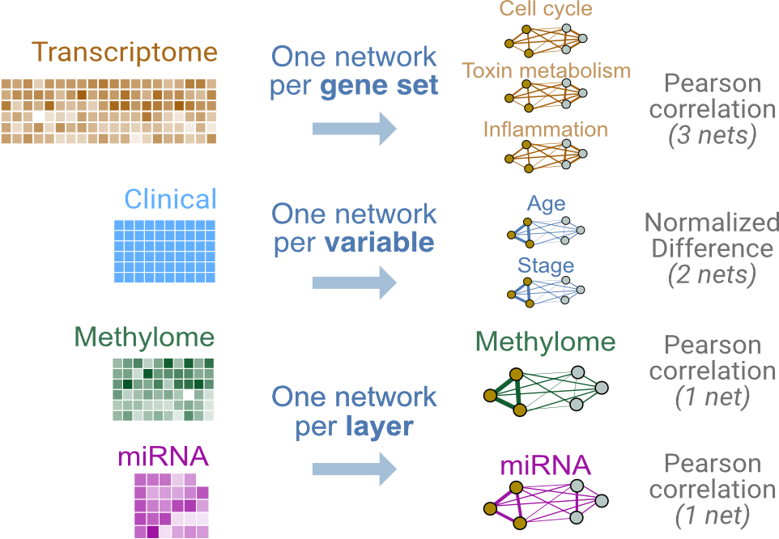

# TL;DR
This code block is not evaluated. Need a breakdown? Look at the following sections.
```{r,eval=TRUE}
```

# Introduction

In this lab we will build a predictor to classify three different types of breast tumours, two of a luminal subtype (Luminal A and Luminal B), and one of a basal subtype. 

For this we will use data from the  The Cancer Genome Atlas, and will integrate four types of -omic data: 

* gene expression from Agilent mRNA microarrays
* DNA methylation (Illumina HumanMethylation 27K microarrays))
* proteomic measures from reverse-phase protein arrays, and 
* miRNA sequencing 


```{r, fig.cap="Lab 1 design: We will integrate four layers of genomic data. Each layer will be converted into a single patient similarity network using Pearson correlation for pairwise similarity. ",echo=FALSE}

```

## Get and prepare data

In this example, we use curated multi-modal data from The Cancer Genome Atlas, gotten from the BioConductor `curatedTCGAData` package. Data for all cancer types profiled in TCGA are available through this package; [see this tutorial for details](https://bioconductor.org/packages/release/data/experiment/vignettes/curatedTCGAData/inst/doc/curatedTCGAData.html). 

```{r, class.source="codeblock",eval=TRUE}
suppressMessages(library(curatedTCGAData))
```

# Data 

In this example, we use curated data from The Cancer Genome Atlas, through the BioConductor `curatedTCGAData` package. The goal is to classify a breast tumour into either a Luminal A subtype or otherwise. The predictor will integrate clinical variables selected by the user, along with gene expression data.

Here we load the required packages and download clinical and gene expression data.
```{r,eval=TRUE}
suppressMessages(library(curatedTCGAData))
```

Let's take a look at the available data for breast cancer, without downloading any (set `dry.run=TRUE`). 
Note that the new release of BioConductor (3.13) actually allows users to fetch one of two versions of TCGA data. 

```{r, class.source="codeblock",eval=TRUE}
curatedTCGAData(diseaseCode="BRCA", assays="*",dry.run=TRUE, version="1.1.38")
```
Now let's actually download the data, getting just the four layers we need:

```{r, class.source="codeblock",eval=TRUE}
brca <- suppressMessages(curatedTCGAData("BRCA",
                                         c("mRNAArray","Methylation_methyl27", 
										 "RPPAArray","miRNASeqGene"),
                                         dry.run=FALSE, version="1.1.38"))
```

This call returns a `MultiAssayExperiment` object. Recall that this is a container for storing multiple assays performed on the same set of samples. [See this tutorial](https://bioconductor.org/packages/release/bioc/vignettes/MultiAssayExperiment/inst/doc/QuickStartMultiAssay.html) to learn more.

Let's briefly explore the `brca` `MultiAssayExperiment` object.

```{r, class.source="codeblock",eval=TRUE}
brca
```

`assays()` returns a `list` with all -omic data associated with this object.  

```{r, class.source="codeblock",eval=TRUE}
summary(assays(brca))
```
`names()` shows the datatypes in each slot of `assays()`:

```{r, class.source="codeblock",eval=TRUE}
names(assays(brca))
```

So miRNA data is in slot 1, gene expression in slot 2, etc., 

We can subset the data to see what it looks like. Let's do that for the miRNA data, looking at just the first five measures:

```{r, class.source="codeblock",eval=TRUE}
mir <- assays(brca)[["BRCA_miRNASeqGene-20160128"]]
head(mir[,1:5])
```

Patient metadata is contained in the `colData()` slot. Rows contain data for each patient and columns contain measures such as clinical characteristics:

```{r, class.source="codeblock",eval=TRUE}
pheno <- colData(brca)
colnames(pheno)[1:20]
head(pheno[,1:5])
```

This next code block prepares the TCGA data. This includes:

* removing duplicate samples
* reformatting patient IDs (e.g. removing spaces and hyphens)
* creating an `ID` column in `colData(brca)`, which contains unique patient IDs
* creating a `STATUS` column in `colData(brca)` which contains the patient labels (i.e what we want netDx to classify). 


In practice you would prepare the dataset once and save it to file, then separately load it before running netDx; i.e. decouple data processing and running the predictor. The data processing code has been moved into a supporting file, `prepare_data.R`. You can explore it after the lab to see how some things are achieved (e.g. removing duplicate samples). For now, let's just run it.

```{r, class.source="codeblock",eval=TRUE}
source("prepare_data.R")
brca <- prepareData(brca)
```

The important thing is to create `ID` and `STATUS` columns in the sample metadata table. netDx uses these to get the patient identifiers and labels, respectively.


```{r, class.source="codeblock",eval=TRUE}
pheno <- colData(brca)
head(pheno[,c("ID","STATUS")])
table(pheno$STATUS,useNA="always")  # good practice: useNA="always" shows missing values
```

## Create feature design rules

Now let's set up the data for input to netDx. 

netDx allows the user to define how data is converted into patient similarity networks (or PSNs), which are the features that go into the model. This is done specifically by telling the model how to:

* **group** different types of data and 
* **define similarity** for each of these (e.g. Pearson correlation, normalized difference, etc.,).

The relevant input parameters are:

* `groupList`: sets of input data that would correspond to individual networks (e.g. genes grouped into pathways)
* `makeNets()`: an R function telling netDx what similarity metric to use for each data layer

Let's start by loading the `netDx` package.


```{r, class.source="codeblock",eval=TRUE}
suppressWarnings(suppressMessages(require(netDx)))
```

Let's set up each of the input arguments one by one.

### groupList
**What is this:** `groupList` tells netDx how to group measures within a layer, to generate a PSN. Measures could be individual genes, proteins, CpG bases (in DNA methylation data), clinical variables, etc., 

In this simple example we just create a single PSN for each datatype, containing all measures from that datatype.


```{r, class.source="codeblock",eval=TRUE}
expr <- assays(brca)
groupList <- list()
for (k in 1:length(expr)) {	# loop over all layers
	cur <- expr[[k]]; nm <- names(expr)[k]

	# all measures from this layer go into our single PSN
	groupList[[nm]] <- list(nm=rownames(cur)) 

	# assign same layer name as in input data
	names(groupList[[nm]])[1] <- nm;
}
```
Notice that `groupList` is a two tiered list, or list-of-lists. The first tier is for each data layers, with names matching those in `assays(brca)`. The second tier contains all the PSNs we want to make for that layer. In this lab exercise we create only one PSN per data layer, using all the measures from an -omic assay. e.g. One PSN based on similarity across entire transcriptome, one for methylome, etc.,). So in this lab exercise, the inner tier simply contains one entry, with all measures for the given layer. 

This design will get more interesting in Lab 2, when we create pathway-level features. 

Let's take a look at `groupList`. Here is the first tier:


```{r, class.source="codeblock",eval=TRUE}
summary(groupList)
```

And the second tier:

```{r, class.source="codeblock",eval=TRUE}
names(groupList[["BRCA_mRNAArray-20160128"]])
length(groupList[["BRCA_mRNAArray-20160128"]][[1]])
head(groupList[["BRCA_mRNAArray-20160128"]][[1]])
```

### Define patient similarity for each network
The `makeNets` function tells the predictor how to create networks from provided input data.

This function requires `dataList`,`groupList`, and `netDir` as input variables. The residual `...` parameter is to pass additional variables to `makePSN_NamedMatrix()`, notably `numCores` (number of parallel jobs).

netDx requires that this function have:

* `dataList`,`groupList`, and `netDir` as input variables. The residual `...` parameter is to pass additional variables to `makePSN_NamedMatrix()`, notably number of cores for parallel processing (`numCores`). 


```{r, class.source="codeblock", eval=TRUE}
makeNets <- function(dataList, groupList, netDir,...) {
	netList <- c() # initialize before is.null() check
	
	layerNames <- c("BRCA_miRNASeqGene-20160128",
		"BRCA_mRNAArray-20160128",
		"BRCA_RPPAArray-20160128",
		"BRCA_Methylation_methyl27-20160128")
	
	for (nm in layerNames){  			## for each layer
		if (!is.null(groupList[[nm]])){ ## must check for null for each layer
			netList_cur <- makePSN_NamedMatrix(
				dataList[[nm]],
				rownames(dataList[[nm]]),	## names of measures (e.g. genes, CpGs)
				groupList[[nm]],			## how to group measures in that layer
				netDir,						## leave this as-is, netDx will figure out where this is.
				verbose=FALSE, 			
				writeProfiles=TRUE,   		## use Pearson correlation-based similarity
				...
				)

			netList <- c(netList,netList_cur)	## just leave this in
		}
	}
	return(unlist(netList))	## just leave this in 
}
```

## Build predictor

Finally we call the function that runs the netDx predictor. We provide:

* patient data  (`dataList`)
* grouping rules (`groupList`)
* function to create PSN from data, includes choice of similarity metric (`makeNetFunc`)
* number of train/test splits over which to collect feature scores and average performance (`numSplits`), 
* maximum score for features in one round of feature selection  (`featScoreMax`, set to 10)
* threshold to call feature-selected networks for each train/test split (`featSelCutoff`); only features scoring this value or higher will be used to classify test patients,
* number of cores to use for parallel processing (`numCores`).

The call below runs 10 train/test splits. 
Within each split, it:

* splits data into train/test using the default split of 80:20 (`trainProp=0.8`)
* score networks between 0 to 10 (i.e. `featScoreMax=10L`)
* uses networks that score >=9 out of 10 (`featSelCutoff=9L`) to classify test samples for that split.

```{block,type="rmd-design"}
In practice a good starting point is `featScoreMax=10`, `featSelCutoff=9` and `numSplits=10L`, but these parameters depend on the sample sizes in the dataset and heterogeneity of the samples.
``` 

This step can take a few hours based on the current parameters, so we're commenting this out for the tutorial and will simply load the results.
 
```{r lab1-buildpredictor ,class.source="codeblock",eval=TRUE}
t0 <- Sys.time()
set.seed(42) # make results reproducible
outDir <- paste(tempdir(),randAlphanumString(),
	"pred_output",sep=getFileSep())
if (file.exists(outDir)) unlink(outDir,recursive=TRUE)
model <- suppressMessages(buildPredictor(
	dataList=brca,			## your data
	groupList=groupList,	## grouping strategy
	makeNetFunc=makeNets,	## function to build PSNs
	outDir=outDir, 			## output directory
	trainProp=0.8,			## pct of samples to use to train model in
							## each split
	numSplits=2L,			## number of train/test splits
 featSelCutoff=1L,		## threshold for calling something
							## feature-selected
	featScoreMax=2L,		## max score for feature selection
 numCores=2L,			## set higher for parallelizing
 debugMode=FALSE,
 keepAllData=FALSE,	## set to TRUE for debugging or low-level files used by the dictor
 logging="none"
  ))
t1 <- Sys.time()
print(t1-t0)
```

## Examine results

Now we get model output, including performance for various train/test splits and consistently high-scoring features. 

Let's load those:

```{r, class.source="codeblock",eval=TRUE}
outFile <- sprintf("%s/CBW_Lab1_full.rda",tempdir())
download.file("https://github.com/RealPaiLab/CBW_CAN_DataIntegration_2021/raw/master/supporting_files/Lab1_files/Lab1_10splits.rda",
	destfile=outFile)
lnames <- load(outFile)
```

In the function below, we define top-scoring features as those which score at least 9 in at least 90% of the train/test splits:

```{r lab1-getresults,class.source="codeblock",eval=TRUE}
results <- getResults(brca,model_full,featureSelCutoff=9L,
	featureSelPct=0.9)
```

`results` contains `performance`, `selectedFeatures` for each patient label, and the table of feature `scores`.

```{r, class.source="codeblock",eval=TRUE}
summary(results)
```

Look at the performance:
```{r, class.source="codeblock",eval=TRUE}
results$performance
```

Look at feature scores for all labels, across all train-test splits:

```{r, class.source="codeblock", eval=TRUE}
results$featureScores
```

Let's examine our confusion matrix:
```{r, class.source="codeblock",eval=TRUE}
confMat <- confusionMatrix(model_full)
```

*Note: Rows of this matrix don't add up to 100% because the matrix is an average of the confusion matrices from all of the train/test splits.*

And here are selected features, which are those scoring 2 out of 2 in at least half of the splits. This threshold is simply for illustration. In practice we would run at least 10 train/test splits (ideally 100+), and look for features that score 7+ out of 10 in >70% splits.

```{r, class.source="codeblock",eval=TRUE}
results$selectedFeatures
```

We finally get the integrated PSN and visualize it using a tSNE plot:

```{r, class.source="codeblock",fig.width=8,fig.height=8, eval=TRUE}
## this call doesn't work in Rstudio; for now we've commented this out and saved the PSN file. 
## psn <- getPSN(brca,groupList_full,makeNets_full,results$selectedFeatures)

psnFile <- sprintf("%s/psn.rda",tempdir())
download.file("https://github.com/RealPaiLab/CBW_CAN_DataIntegration_2021/raw/master/supporting_files/Lab1_files/Lab1_PSN.rda",
	destfile=outFile)
load(outFile)

require(Rtsne)
tsne <- tSNEPlotter(
	psn$patientSimNetwork_unpruned, 
	colData(brca)
	)
```


## sessionInfo
```{r}
sessionInfo()
```
