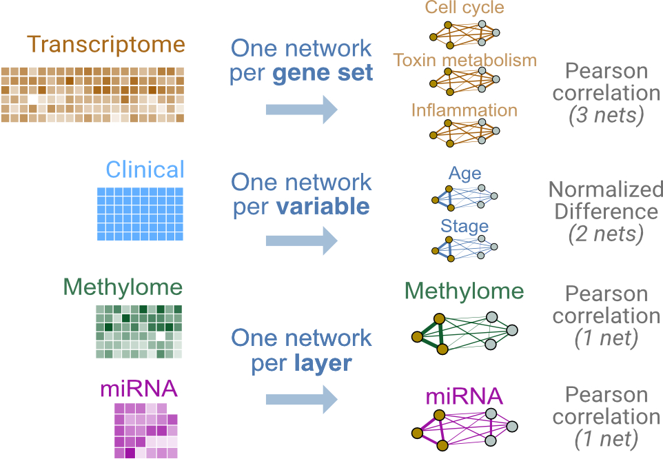
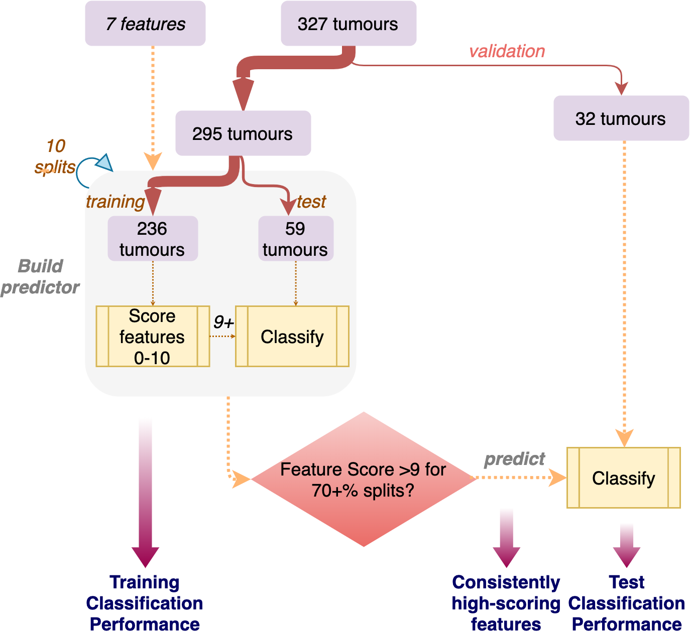

# Introduction

In this example, we will use clinical data and three types of 'omic data for binary classification of breast tumours. We also use several strategies and definitions of similarity to create features.

For this we will use data from the  The Cancer Genome Atlas, and will integrate four types of -omic data: 

* gene expression from Agilent mRNA microarrays
* DNA methylation (Illumina HumanMethylation 27K microarrays))
* proteomic measures from reverse-phase protein arrays, and 
* miRNA sequencing 


Figure 1 shows the rules for converting patient data into similarity networks, which serve as units of input (or "features") for the model.

* Gene expression: Features are defined at the level of ***pathways***; i.e. a feature groups genes corresponding to the pathway. Similarity is defined as pairwise *Pearson correlation*
 * Clinical variables: Each *variable* is its own feature and similarity is defined as *normalized difference*. 
 * Proteomic and methylation data: Features are defined at the level of the entire *data layer*; a single feature is created for all of proteomic data, and the same for methylation. Similarity is defined by pairwise *Pearson correlation*


```{r,eval=TRUE,echo=FALSE,out.width="100%",fig.cap="Predictor design."}
knitr::opts_chunk$set(crop=NULL)

```
 
 The overall workflow for building and testing the predictor is shown in Figure 2.  
 
 We start with a dataset with 327 tumours. 90% of the samples are used to build the predictor (`buildPredictor()`) while 10% are randomly subsampled and set aside for independent validation (`subsampleValidationData()`). Building the predictor involves:

 1. Splitting samples into 80% training and 20% test samples (proportions can be changed by setting parameters for `buildPredictor()`)
 2. Running feature selection using the training samples, so that features are scored from 0 to some user-specified max value.
 3. Features passing cutoff are used to classify the 20% test samples.
 
 This process is repeated with multiple random train/test splits to generate an average performance of the model on training data. Features with a consistent high score across all train/test splits are selected to build a final model.

 The model is then evaluated on the independent validation set (here, the held-out 10% of samples), using only the consistently high scoring features (i.e. features passing selection). This steps ascertains the model's test set performance.


```{r,eval=TRUE,echo=FALSE,out.width="80%",fig.cap="Workflow."}

``` 

In this example, we build a minimal predictor to ensure the vignette builds in a feasible time. Here we use two train/test splits, score features from 0-2, call features scoring >0 selected features within a given train/test split. For building the final model, we choose features that score 1 or higher in at least half the splits. These are not realistic parameters because they do not sufficiently resample training data to ensure generalizability.

In practice reasonable values include 10 train/test splits, features scored at least out of 10, and the final model being built with features scoring 7 or higher. Try several designs to see which consistently generalizes to an independent test set (hyperparameter tuning).

# Setup 
Load the `netDx` package.

```{r,eval=TRUE}
suppressWarnings(suppressMessages(require(netDx)))
```

# Get and Prepare Data 

In this example, we use curated multi-modal data from The Cancer Genome Atlas, gotten from the BioConductor `curatedTCGAData` package. Data for all cancer types profiled in TCGA are available through this package; [see this tutorial for details](https://bioconductor.org/packages/release/data/experiment/vignettes/curatedTCGAData/inst/doc/curatedTCGAData.html). 

```{r,eval=TRUE}
suppressMessages(library(curatedTCGAData))
```

Let's take a look at the available data for breast cancer, without downloading any (set `dry.run=TRUE`). 
Note that from BioC 3.13 onwards, users may fetch one of two versions of TCGA data.

```{r,eval=TRUE}
curatedTCGAData(diseaseCode="BRCA", assays="*",dry.run=TRUE,version="1.1.38")
```

In this call we fetch only the gene expression, proteomic and methylation data; setting `dry.run=FALSE` initiates the fetching of the data.

```{r,eval=TRUE}
brca <- suppressMessages(
   curatedTCGAData("BRCA",
               c("mRNAArray","miRNA*","Methylation_methyl27*"),
	dry.run=FALSE,version="1.1.38"))
```

This call returns a `MultiAssayExperiment` object. Recall that this is a container for storing multiple assays performed on the same set of samples. [See this tutorial](https://bioconductor.org/packages/release/bioc/vignettes/MultiAssayExperiment/inst/doc/QuickStartMultiAssay.html) to learn more.

## MultiAssayExperiment object
Skip this section if you are familiar with MultiAssayExperiment objects.

Let's briefly explore the `brca` `MultiAssayExperiment` object.

```{r, class.source="codeblock",eval=TRUE}
brca
```

`assays()` returns a `list` with all -omic data associated with this object.  

```{r, class.source="codeblock",eval=TRUE}
summary(assays(brca))
```
`names()` shows the datatypes in each slot of `assays()`:

```{r, class.source="codeblock",eval=TRUE}
names(assays(brca))
```

So miRNA data is in slot 1, gene expression in slot 2, etc., 

We can subset the data to see what it looks like. Let's do that for the miRNA data, looking at just the first five measures

```{r, class.source="codeblock",eval=TRUE}
mir <- assays(brca)[["BRCA_miRNASeqGene-20160128"]]
head(mir[,1:5])
```

Patient metadata is contained in the `colData()` slot. Rows contain data for each patient and columns contain measures such as clinical characteristics:

```{r, class.source="codeblock",eval=TRUE}
pheno <- colData(brca)
colnames(pheno)[1:20]
head(pheno[,1:5])
```

## Prepare data
This next code block prepares the TCGA data. This includes:

* removing duplicate samples
* reformatting patient IDs (e.g. removing spaces and hyphens)
* creating an `ID` column in `colData(brca)`, which contains unique patient IDs
* creating a `STATUS` column in `colData(brca)` which contains the patient labels (i.e what we want netDx to classify). 


In practice you would prepare the dataset once and save it to file, then separately load it before running netDx; i.e. decouple data processing and running the predictor. The data processing code has been moved into a supporting file, `prepare_data.R`. You can explore it after the lab to see how some things are achieved (e.g. removing duplicate samples). For now, let's just run it.


```{r,eval=TRUE}
source("prepare_data.R")
brca <- prepareData(brca,setBinary=TRUE)
```

The important thing is to create `ID` and `STATUS` columns in the sample metadata slot. netDx uses these to get the patient identifiers and labels, respectively.

```{r,eval=TRUE}
pID <- colData(brca)$patientID
colData(brca)$ID <- pID
```

## Holdout validation set

The function `subSampleValidationData` partitions the TCGA data into two smaller datasets: a training and holdout validation dataset. This is to facilitate model validation after an initial model is built by the netDx algorithm - netDx will train a model on the training dataset through the `buildPredictor()` call, and this model can validate the held-out validation dataset through the `predict()` function call.

```{r,eval=TRUE}
set.seed(123)
dsets <- subsampleValidationData(brca,pctValidation=0.1)
brca <- dsets$trainMAE
holdout <- dsets$validationMAE
```

# Rules to create features (patient similarity networks)

Now let's set up the data for input to netDx. 

netDx allows the user to define how data is converted into patient similarity networks (or PSNs), which are the features that go into the model. This is done specifically by telling the model how to:

* **group** different types of data and 
* **define similarity** for each of these (e.g. Pearson correlation, normalized difference, etc.,).

The relevant input parameters are:

* `groupList`: sets of input data that would correspond to individual networks (e.g. genes grouped into pathways)
* `sims`: a list specifying similarity metrics for each data layer

### groupList: Grouping variables to define features
**What is this:** `groupList` tells netDx how to group measures within a layer, to generate a PSN. Measures could be individual genes, proteins, CpG bases (in DNA methylation data), clinical variables, etc., 

In this simple example we just create a single PSN for each datatype, containing all measures from that datatype.

In the code below, we fetch pathway definitions for January 2021 from [https://downloads.res.oicr.on.ca/pailab/](https://downloads.res.oicr.on.ca/pailab/) and group gene expression data by pathways. To keep this example short, we limit to only three pathways, but in practice you would use all pathways meeting a size criterion; e.g. those containing between 10 and 500 genes (see the `MIN_SIZE` and `MAX_SIZE` parameters of `readPathways()`). 

```{r,eval=TRUE}
groupList <- list()

# genes in mRNA data are grouped by pathways
pathFile <- sprintf("%s/extdata/pathway_ex3.gmt", path.package("netDx"))
pathList <- suppressMessages(readPathways(pathFile))
groupList[["BRCA_mRNAArray-20160128"]] <- pathList
```

Let's take a look at `groupList`. Here is the first tier, which currently only has gene expression data. You can see that `groupList` has three features for gene expression data (`Length` is `3`).

```{r, class.source="codeblock",eval=TRUE}
summary(groupList)
```

Now we look at what comprises the pathway-features. Let's look at the names of the pathways:

```{r, class.source="codeblock",eval=TRUE}
names(groupList[["BRCA_mRNAArray-20160128"]])
```

How many genes are in the first pathway? Take a look at the genes in the pathway, using `head()`
```{r,eval=TRUE}
length(groupList[["BRCA_mRNAArray-20160128"]][[1]])
```

```{r,eval=TRUE}
head(groupList[["BRCA_mRNAArray-20160128"]][[1]])
```

For clinical data, we do not group variables. Rather, we create one feature each for two variables:

```{r,eval=TRUE}
groupList[["clinical"]] <- list(
    age="patient.age_at_initial_pathologic_diagnosis",
	  stage="STAGE"
)
```

For miRNA sequencing, methylation, and proteomic data we create one feature each, where each feature contains all measures for that data type.

```{r,eval=TRUE}
tmp <- list(rownames(experiments(brca)[[1]]));
names(tmp) <- names(brca)[1]
groupList[[names(brca)[[1]]]] <- tmp

tmp <- list(rownames(experiments(brca)[[3]]));
names(tmp) <- names(brca)[3]
groupList[[names(brca)[3]]] <- tmp
```

### `sims`: Define patient similarity for each network

**What is this:** `sims` is used to define similarity metrics for each layer.
This is done by providing a single list -  here, `sims` - that specifies the choice of similarity metric to use for each data layer. The `names()` for this list must match those in `groupList`. The corresponding value can either be a character if specifying a built-in similarity function, or a function. The latter is used if the user wishes to specify a custom similarity function.

The current available options for built-in similarity measures are:

* `pearsonCorr`: Pearson correlation (n>5 measures in set)
* `normDiff`: normalized difference (single measure such as age)
* `avgNormDiff`: average normalized difference (small number of measures)
* `sim.pearscale`: Pearson correlation followed by exponential scaling
* `sim.eucscale`: Euclidean distance followed by exponential scaling

In this example, we choose Pearson correlation similarity for all data layers except for the single-variable features in the `clinical` layer. For that we use normalized difference.

```{r,eval=TRUE}
sims <- list(
  "BRCA_mRNAArray-20160128"="pearsonCorr",
  clinical="normDiff",
  "BRCA_miRNASeqGene-20160128"="pearsonCorr",
  "BRCA_Methylation_methyl27-20160128"="pearsonCorr"
  )

```

# Build predictor

Now we're ready to train our model. netDx uses parallel processing to speed up compute time. Let's use 75% available cores on the machine for this example. netDx also throws an error if provided an output directory that already has content, so let's clean that up as well.
  
```{r,eval=TRUE}
nco <- round(parallel::detectCores()*0.75) # use 75% available cores
message(sprintf("Using %i of %i cores", nco, parallel::detectCores()))

outDir <- paste(tempdir(),"pred_output",sep=getFileSep()) # use absolute path
if (file.exists(outDir)) unlink(outDir,recursive=TRUE)
numSplits <- 2L
```

Finally we call the function that builds the predictor. We provide:

* patient data  (`dataList`)
* grouping rules (`groupList`)
* function to create PSN from data, includes choice of similarity metric (`makeNetFunc`)
* number of train/test splits over which to collect feature scores and average performance (`numSplits`), 
* maximum score for features in one round of feature selection  (`featScoreMax`, set to 10)
* threshold to call feature-selected networks for each train/test split (`featSelCutoff`); only features scoring this value or higher will be used to classify test patients,
* number of cores to use for parallel processing (`numCores`).

The call below runs two train/test splits. Within each split, it:

* splits data into train/test using the default split of 80:20 (`trainProp=0.8`)
* score networks between 0 to 2 (i.e. `featScoreMax=2L`)
* uses networks that score >=1 out of 2 (`featSelCutoff=1L`) to classify test samples for that split.

In practice a good starting point is `featScoreMax=10`, `featSelCutoff=9` and `numSplits=10L`, but these parameters depend on the sample sizes in the dataset and heterogeneity of the samples.

```{r,eval=TRUE}
t0 <- Sys.time()
model <- suppressMessages(
buildPredictor(
	dataList=brca,			## your data
	groupList=groupList,	## grouping strategy
	sims=sims,
	outDir=outDir, 			## output directory
	trainProp=0.8,			## pct of samples to use to train model in
							    ## each split
	numSplits=2L,			 ## number of train/test splits
 	featSelCutoff=1L,		## threshold for calling something
							    ## feature-selected
	featScoreMax=2L,	## max score for feature selection
 numCores=nco,			  ## set higher for parallelizing
 debugMode=FALSE,
 keepAllData=FALSE,	    ## set to TRUE for debugging
 logging="none"     ## set to "default" for messages
  ))
t1 <- Sys.time()
print(t1-t0)
```

# Examine results

We now use `getResults()` to fetch the model performance for the various train/test splits as well as feature scores:

```{r,eval=TRUE}
results <- getResults(
    model,
    unique(colData(brca)$STATUS),
    featureSelCutoff=2L,
    featureSelPct=0.50
  )
```

`results` contains `performance`, `selectedFeatures` for each patient label, and the table of feature `scores`.

```{r, class.source="codeblock",eval=TRUE}
summary(results)
```

Look at the performance:
```{r, class.source="codeblock",eval=TRUE}
results$performance
```

Look at feature scores for all labels, across all train-test splits:

```{r, class.source="codeblock", eval=TRUE}
results$featureScores
```

Let's examine our confusion matrix:
```{r, class.source="codeblock",eval=TRUE}
confMat <- confusionMatrix(model)
```

*Note: Rows of this matrix don't add up to 100% because the matrix is an average of the confusion matrices from all of the train/test splits.*

And here are selected features, which are those scoring 2 out of 2 in at least half of the splits. This threshold is simply for illustration. In practice we would run at least 10 train/test splits (ideally 100+), and look for features that score 7+ out of 10 in >70% splits.

```{r, class.source="codeblock",eval=TRUE}
results$selectedFeatures
```

# Validate on independent samples
Now we use `predict()` to classify samples in the independent dataset. We provide the model with feature design rules in `groupList`, the list of selected features to use in `featSelNet`, the function to convert data into patient similarity networks in `makeNets`, as well as the original and validated datasets in `brca` and `holdout` respectively.

The training data needs to be provided because netDx creates a single patient similarity network with both training and test data. It then uses label propagation to "diffuse" patient labels from training samples to test samples, and labels the latter based on which class they are most similar to.

```{r,eval=TRUE}
outDir <- paste(tempdir(), randAlphanumString(), 
  sep = getFileSep())
if (file.exists(outDir)) unlink(outDir,recursive=TRUE)
dir.create(outDir)

predModel <- suppressMessages(
  predict(trainMAE=brca, testMAE=holdout, 
    groupList=groupList, 
    selectedFeatures=results$selectedFeatures, 
    sims=sims,
    outDir=outDir, verbose = FALSE)
)
```

# Plot results of validation

Finally we examine how well our model performed, using `getPerformance()`. 

Compute performance:
```{r,eval=TRUE}
perf <- getPerformance(predModel, 
  unique(colData(brca)$STATUS))
summary(perf)
```

We plot the AUROC and AUPR curves using `plotPerf_multi()`. In this example we get perfect separation of the two classes.

```{r,eval=TRUE}
plotPerf_multi(list(perf$rocCurve),
  plotTitle = sprintf(
    "BRCA Validation: %i samples", 
    nrow(colData(holdout))))
plotPerf_multi(list(perf$prCurve), 
  plotType = "PR",
  plotTitle = sprintf(
    "BRCA Validation: %i samples", 
    nrow(colData(holdout))))

```

## Integrated patient similarity network
We finally get the integrated PSN and visualize it using a tSNE plot:

```{r, class.source="codeblock",fig.width=8,fig.height=8, eval=TRUE}
## this call doesn't work in Rstudio; for now we've commented this out and saved the PSN file. 
psn <- suppressMessages(getPSN(
  brca,
  groupList,
  sims=sims,
  selectedFeatures=results$selectedFeatures
))
```

We can plot a lower dimensional representation of the patient similarities using a tSNE plot. This call requires that you install the `Rtsne` package:

```{r}
library(Rtsne)
tsne <- tSNEPlotter(
	psn$patientSimNetwork_unpruned, 
	colData(brca)
	)
```

# sessionInfo
```{r,eval=TRUE}
sessionInfo()
```
