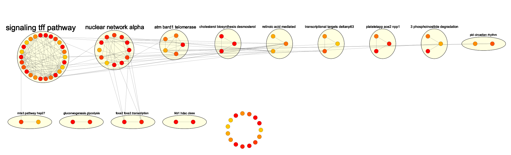

In this example, we will load a trained netDx model and visualize top-scoring pathways using the popular network visualization software, [Cytoscape](cytoscape.org). 

# Setup
Let's download a pre-trained model created for binary breast tumour classification. 

This model used only gene expression as input for 295 tumours classified as either "Luminal A" or not. This predictor used a *pathway-based design*, meaning that each input feature was created from a gene set representing a pathway. Pathways were compiled from a collection of curated pathway databases, including NetPath, mSigDB, Panther, Reactome, and IOB (Ref 1.). In this simple design, features are scored out of ten, over ten splits of train/test data. 

Here we start by loading the model generated by running the `buildPredictor()` call:

```{r,eval=TRUE}
suppressMessages(require(netDx))
data(model_full)
```

Let's examine the model. We can see that it has data from 10 train/test splits. 
```{r,eval=TRUE}
summary(model_full)
```

Let's examine the list of gene sets used to create pathway features.
```{r,eval=TRUE}
length(pathList)
head(names(pathList))
summary(pathList[1:3])
```

Now we generate results from the pathways, calling features that score 9+ out of 10 for over 70% of the train/test splits.
```{r,eval=TRUE}
results <- getResults(
    model_full,
    c("Luminal.A","other"), # patient classes
    featureSelCutoff=9L,
    featureSelPct=0.70,
    drawPerformancePlot=FALSE
)
```

We create the input for the network-based visualization. netDx automatically writes the input files to a user-provided directory, here `emapdir`. These files are available if the user wants to generate the visualization from scratch in Cytoscape.

```{r,eval=TRUE}
vizmap <- createInputForFeatureNetworkView(
    model=model_full,
    results=results,
    pathwayList=pathList,
    EMapMinScore=3L, 
    EMapMaxScore=10L,
    EMapPctPass=0.7,
    outDir=normalizePath(tempdir())
)
```

We now run the command to generate the visualization in Cytoscape. 

This code block has been disabled for the vignette because Cytoscape is not installed on BioConductor build systems. Follow instructions in the next section to run it in your local environment.

# Generate the feature networks in Cytoscape
Some parts of this vignette have been commented out as they require Cytoscape to be installed with the supporting apps needed for the visualization. To see a live demo of the network-based visualization, follow these steps:
1. [Download and install Cytoscape](https://cytoscape.org/download.html). 
2. Open Cytoscape. Using the App Store, install the 'EnrichmentMap' and 'AutoAnnotate' apps. 
3. In R, [install RCy3](https://bioconductor.org/packages/release/bioc/html/RCy3.html).
4. Uncomment the call to `viewSelectedFeaturesAsNetworks()` below and run the vignette code.

A Cytoscape tutorial is out of scope for this vignette but we refer you to [http://manual.cytoscape.org](http://manual.cytoscape.org/).

This step will generate the following network-based view of top-scoring features.  (Note: Exact node/edge position may vary).

```{r,eval=TRUE}
viewSelectedFeaturesAsNetworks(
 vizmap$GMTfiles[[1]],
 vizmap$NodeStyles[[1]],
  hideNodeLabels = TRUE,
 groupClusters = TRUE
 )
```

The resulting view should look like this:

```{r,eval=TRUE,echo=FALSE,fig.cap="Network visualization of features after applying grid layout"}

```

In Cytoscape, this type of visualization is called an Enrichment Map (Ref 1). In the above view, each *node* is a **high-scoring pathway-level feature**. We specified score thresholds in the call to `createInputForFeatureNetworkView()` , specifically limiting our view to features that score 3 or higher, in at least 70% of the train/test splits (`EMapMinScore=3L`,`EMapMaxScore=10L`, `EMapPctPass=0.7`). This wide range of scores is used to illustrate how node colours reflect feature scores. In practice you would likely want to focus on high-scoring features, such as those that consistently score 7 or higher).

Each *edge* **connects two pathways with shared member genes**. 

The *yellow bubbles* identify clusters of related features (here, pathways) and may be interpreted as a pathway theme. The labels above the yellow bubbles are auto-generated by Cytoscape using a word-cloud based approach. While a good start, they almost always require manual refinement after examining the pathways in a cluster. 

# sessionInfo()

```{r,eval=TRUE}
sessionInfo()
```
